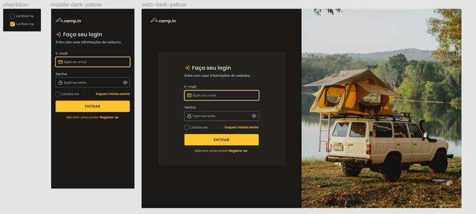

<h1>Camp-in</h1>

<h2>Objetivos<h2>
  <ul>
    <li>Utilizar conhecimentos sobre HTML5 de forma semântica aplicando conceitos sobre a criação de formulários eficientes</li>
    <li>Utilizar conceitos de Css Grid Layout e Flexbox para posicionamento dos elementos que compõe a tela</li>
    <li>Utilizar o pré-processador CSS Sass para otimizar a implementação da interface</li>
    <li>Utilizar os padrões BEM e Atomic designer para melhor organização, manutenção e desenvolvimento das folhas de estilos</li>
    <li>Utilizar a metodologia mobile first para desenvolvimento de interface responsiva</li>
  </ul>
